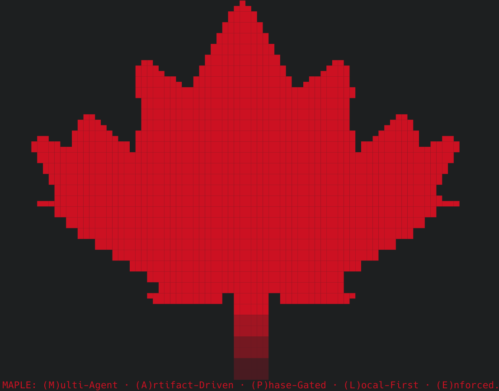

[](https://github.com/kinncj/MAPLE/actions/workflows/ci.yml)
[](https://github.com/kinncj/MAPLE/actions/workflows/validate-integrations.yml)

**MAPLE** is the orchestration layer that connects Claude Code, OpenCode, Cursor, and GitHub Copilot CLI into a unified, TDD-enforced development lifecycle. One binary installs everything: agents, skills, hooks, and a live project dashboard.

> Based on: [Building MAPLE: Orchestrated Multi-Agent Systems with Claude Code and OpenCode](./ARTICLE.md)

<div align="center">
  
  <br/>
  <sub><code>maple init</code> — scaffolding a new project from the CLI</sub>
</div>

---

## Install

**macOS / Linux** — one line, no Go required:

```bash
curl -fsSL https://raw.githubusercontent.com/kinncj/MAPLE/main/scripts/install.sh | bash
```

Installs `maple` and `rtk` to `~/.tools/maple/bin/`. Add to `PATH`:

```bash
echo 'export PATH="$HOME/.tools/maple/bin:$PATH"' >> ~/.zshrc && source ~/.zshrc
```

**Windows** (PowerShell):

```powershell
irm https://raw.githubusercontent.com/kinncj/MAPLE/main/scripts/install.ps1 | iex
```

**Build from source** (Go 1.22+):

```bash
git clone https://github.com/kinncj/MAPLE.git && cd MAPLE
make build-tui        # → ./maple
sudo mv maple /usr/local/bin/
```

---

## Quick Start

```bash
cd your-project
maple init            # scaffold agents, skills, hooks, Makefile
maple                 # open the dashboard
```

Inside the dashboard press `n` to capture requirements and generate a Gherkin story, then hand off to your harness:

```
/feature "user can reset password via email link"
```

---

## What is MAPLE?

**M**ulti-Agent · **A**rtifact-Driven · **P**hase-Gated · **L**ocal-First · **E**nforced.

| | |
|---|---|
| **M — Multi-Agent** | 27+ specialist agents, each with a defined role. The orchestrator never writes code — it delegates to the right specialist every time. TAFFY chains them into named workflows. |
| **A — Artifact-Driven** | A Gherkin story in `docs/stories/` is required before any code is written. `ui: true` stories require approved wireframes and mockups. No artifact, no implementation. |
| **P — Phase-Gated** | Eight phases in order: DISCOVER → ARCHITECT → PLAN → INFRA → IMPLEMENT → VALIDATE → DOCUMENT → FINAL GATE. Humans approve at defined gates. No skipping. |
| **L — Local-First** | Self-contained binary — template embedded, no runtime dependencies. RTK wired as a `PreToolUse` hook reduces token usage 60–90% on build/grep/test output. |
| **E — Enforced** | TDD always. `lefthook` gates on pre-push: spec-kit, frontmatter, design-approved, a11y. WCAG 2.2 AA required for all `ui: true` stories before merge. |

---

## Harness Support

MAPLE works across all four AI coding harnesses. Agents, skills, and TAFFY workflows are mirrored across each.

| Harness | Config dir | TAFFY workflows | Skill entry point |
|---------|-----------|----------------|-------------------|
| Claude Code | `.claude/` | `.claude/taffy/` | `.claude/skills/pipeline-runner/` |
| OpenCode | `.opencode/` | `.opencode/taffy/` | `.opencode/skills/pipeline-runner/` |
| Cursor | `.cursor/` | `.cursor/taffy/` | `.cursor/skills/` |
| GitHub Copilot CLI | `.github/` | shared via instructions | `/pipeline-runner` in chat |

---

## The `maple` Dashboard

Run `maple` inside any project initialized with `maple init`. Recommended: open inside **tmux** or **zellij** so harnesses launch in new tabs without closing the dashboard.

```bash
tmux new-session -s work   # then: maple
# or
zellij                      # then: maple
```

### Keybindings

| Key | Action |
|-----|--------|
| `Tab` / `Shift+Tab` | Cycle panes |
| `j` / `k` | Move cursor down / up |
| `s` `a` `p` `Q` | Jump to Stories / Agents / PRs / QA pane |
| `Enter` | Open detail (story, session, PR, test file) |
| `o` | Open selected session + auto-pin it |
| `p` | Pin selected session to `.claude/state/sessions.json` |
| `L` | Launch overlay — pick harness, type optional command, open in new tab |
| `x` | TAFFY picker — select a workflow, skill, or agent to launch |
| `P` | Pipeline status — live view of active TAFFY run; `[a]` approve gate, `[c]` clear stale |
| `n` | Requirements wizard → new Gherkin story |
| `r` | Run selected test (QA pane) / reload all panes |
| `d` | Design artifacts pane (full-screen toggle) |
| `l` | Logs pane (full-screen toggle) |
| `R` | RTK harness selector — toggle which harnesses have the token optimizer wired |
| `S` | `ship-safe` security audit |
| `F` | Skills marketplace — browse, install, remove |
| `u` | Update — re-sync template files |
| `/` | Search within active pane |
| `:` | Command mode (`:theme <name>`, `:update`, `:req`, `:help`) |
| `?` | Help overlay |
| `q` / `Ctrl+C` | Quit |

**Themes:** `tokyo-night` (default) · `catppuccin-mocha` · `gruvbox` · `nord` · `everforest`

Switch with `:theme <name>`, or auto-detected from `~/.config/omarchy/current/theme`.

### CLI Commands

```bash
maple                          # boot check → dashboard
maple init                     # scaffold MAPLE into current directory
maple init --force             # overwrite existing files
maple req                      # requirements wizard → Gherkin story
maple resume-session           # resume pinned session (reads sessions.json)
maple resume-session claude    # resume the pinned Claude session specifically
maple labels                   # bootstrap GitHub label set
maple project                  # create GitHub Project v2
maple self-update              # upgrade to the latest release
maple --version                # print version
maple --no-animate             # skip animations (SSH / slow terminals)
```

---

## Agent Commands

These run inside any harness (Claude Code, OpenCode, Copilot CLI):

| Command | What it does |
|---------|-------------|
| `/feature "description"` | Full 8-phase pipeline |
| `/bugfix "description"` | Reproduce → fix → validate → CHANGELOG |
| `/validate` | Run full test suite |
| `/tdd "requirement"` | RED → GREEN → REFACTOR cycle |
| `/pipeline-runner <name>` | Launch a named TAFFY workflow |
| `/ship-safe` | Security/quality scan, reports blockers by severity |

---

## TAFFY — Workflow Engine

**T**ask-Isolated · **A**synchronous · **F**ault-Tolerant · **F**ile-Synced · **Y**AML-Driven

MAPLE sets the rules. TAFFY runs the jobs.

| | |
|---|---|
| **T — Task-Isolated** | Each agent job runs in a dedicated subprocess. A 60-second generation loop never freezes the TUI — you keep reviewing PRs or reading specs while the agent works. |
| **A — Asynchronous** | Fire-and-forget from the orchestrator's perspective. TAFFY manages waiting, polling, and completion signals so the rest of the pipeline stays non-blocking. |
| **F — Fault-Tolerant** | Hard timeouts kill stuck agents and mark the job `FAILED`. On `429` rate limits, state is set to `RATE_LIMITED` and the job resumes when the window clears. Three consecutive failures escalate to human. |
| **F — File-Synced** | No Redis, no broker. TAFFY writes state to `.claude/state/maple.json`. The TUI reacts: `RUNNING` → spinner, `PAUSED` → gate indicator, `RATE_LIMITED` → yellow flag, `DONE`/`FAILED` → final status. |
| **Y — YAML-Driven** | Workflows are stateless and deterministic. Each job is a YAML manifest: stage list, agent assignments, gates, guards, artifact expectations. No hidden state. |

### Built-in workflows

| Name | What it runs |
|------|-------------|
| `new-ui-feature` | Spec-Kit → wireframe → mockup → component scaffold → TDD → a11y audit |
| `api-endpoint` | Spec-Kit → architect (ADR) → TDD → implement → contract test → docs |
| `bugfix` | Reproduce → root-cause analysis → fix → regression test → CHANGELOG |
| `design-refresh` | Visual identity → design tokens → component audit → mockup update |

### Running a workflow

**From the dashboard** — press `x` to open the TAFFY picker, select a workflow, and it launches in your active harness.

**From any harness chat:**
```
/pipeline-runner new-ui-feature
/pipeline-runner api-endpoint
```

### Human-approval gates

Stages with `gate: human-approval` pause and write `PAUSED` to `maple.json`. The `[P]` overlay shows the blocked stage. Press `a` in the dashboard to approve and advance, or type "approved" directly in the harness.

### Custom workflows

Add a YAML file to `.claude/taffy/` (mirror to `.opencode/taffy/` for OpenCode support). Schema: `.claude/taffy/schema.yaml`.

```yaml
name: db-migration
description: "Safe database migration: schema → backfill → validate → deploy"
version: "1.0.0"
tags: [infra, database]
stages:
  - name: spec
    agent: spec-kit
    gate: human-approval
  - name: schema
    agent: architect
    depends_on: [spec]
  - name: tests
    agent: qa
    depends_on: [schema]
  - name: implement
    pipeline: standard
    depends_on: [tests]
    gate: human-approval
```

---

## Skills Marketplace

`F` opens the skills.sh marketplace browser. Two tabs:

- **Installed** — all project and global skills; `d` to remove
- **Search** — type a query, `Enter` to find and install

Skills install via `npx skills add <pkg> --all -y` and work across Claude Code, Cursor, and other editors.

---

## Prerequisites

| Tool | Purpose | Required |
|------|---------|----------|
| [Claude Code](https://claude.ai/claude-code), [OpenCode](https://opencode.ai), [Cursor](https://cursor.com), or [Copilot CLI](https://github.com/features/copilot/cli) | Run the agents | At least one |
| [GitHub CLI `gh`](https://cli.github.com) | Issues, PRs, project management | Yes |
| [Go 1.22+](https://go.dev) | Build from source | Source builds only |
| [Node.js](https://nodejs.org) | Cucumber E2E tests + `npx skills` | Optional |
| [Docker](https://docker.com) | Test infrastructure | Optional |

> Pre-built binaries for macOS / Linux / Windows are on every [release](https://github.com/kinncj/MAPLE/releases). Go is only needed to build from source.

---

## Documentation

| Doc | Contents |
|-----|---------|
| [Quickstart — Claude Code](./docs/quickstart-claude-code.md) | Install, scaffold, first feature |
| [Quickstart — OpenCode](./docs/quickstart-opencode.md) | Install, configure providers, first feature |
| [Quickstart — Cursor](./docs/quickstart-cursor.md) | Install, enable Cursor skills, first feature |
| [Quickstart — Copilot CLI](./docs/quickstart-copilot-cli.md) | Install, enable Rubber Duck, first feature |
| [The 8-Phase Pipeline](./docs/pipeline.md) | Phase details, TDD loop, Makefile contract |
| [The Agents](./docs/agents.md) | Full agent roster, skills, adding custom agents |
| [Customization Guide](./docs/customization.md) | Add agents, restrict permissions, extend skills |
| [Architecture Article](./ARTICLE.md) | Design decisions, why specialist agents |
| [Changelog](./CHANGELOG.md) | Full version history |

---

## License

AGPLv3 — see [LICENSE](./LICENSE) for details.

Copyright (C) 2025 Kinn Coelho Juliao <kinncj@protonmail.com>
