# The Agents

Every agent is a single markdown file with a defined role, restricted toolset, and specific instructions. No agent can exceed its role — the orchestrator enforces boundaries. Use whichever model your subscription supports; quality comes from the prompts, not hardcoded model IDs.

---

## Architecture

```mermaid
graph TB
    Human["👤 Human"] -->|feature request| ORC

    subgraph Coordination
        ORC["orchestrator\nnever writes code"]
    end

    subgraph "Discovery & Design"
        PO["product-owner"]
        ARCH["architect"]
    end

    subgraph "Quality & Docs"
        QA["qa"]
        DOCS["docs"]
    end

    subgraph "Backend"
        DN[".NET"]
        JS["javascript"]
        TS["typescript"]
        JV["java"]
        SB["springboot"]
    end

    subgraph "Frontend"
        RV["react-vite"]
        NJ["nextjs"]
    end

    subgraph "Infrastructure"
        K8["kubernetes"]
        TF["terraform"]
        DK["docker"]
    end

    subgraph "Data & Services"
        PG["postgresql"]
        RD["redis"]
        SU["supabase"]
        VC["vercel"]
        ST["stripe"]
    end

    subgraph "ML / Data"
        DS["data-science"]
        DE["data-engineer"]
        TN["tensorflow"]
        PT["pytorch"]
        PA["pandas-numpy"]
        SK["scikit"]
        JP["jupyter"]
    end

    ORC --> PO & ARCH & QA & DOCS
    ORC --> DN & JS & TS & JV & SB & RV & NJ
    ORC --> K8 & TF & DK & PG & RD & SU & VC & ST
    ORC --> DS & DE & TN & PT & PA & SK & JP
```



---

## Full roster

| # | Agent | Role |
|---|---|---|
| 1 | `orchestrator` | Pipeline control — never writes code |
| 2 | `product-owner` | User stories, acceptance criteria |
| 3 | `architect` | ADR, contracts, threat models |
| 4 | `qa` | Write failing tests (RED) + validate (GREEN) |
| 5 | `dotnet` | .NET backend |
| 6 | `javascript` | Node.js / vanilla JS |
| 7 | `typescript` | TypeScript backend/libraries |
| 8 | `react-vite` | React + Vite SPA |
| 9 | `nextjs` | Next.js full-stack |
| 10 | `java` | Java backend (non-Spring) |
| 11 | `springboot` | Spring Boot |
| 12 | `kubernetes` | K8s manifests, Kustomize, Helm |
| 13 | `terraform` | Terraform IaC |
| 14 | `docker` | Dockerfiles, Compose |
| 15 | `postgresql` | Schema, migrations, RLS |
| 16 | `redis` | Caching, pub/sub, streams |
| 17 | `supabase` | Auth, RLS, Edge Functions |
| 18 | `vercel` | Deployment, edge config |
| 19 | `stripe` | Payments, webhooks, billing |
| 20 | `data-science` | EDA, stats, visualization |
| 21 | `data-engineer` | Pipelines, ETL, orchestration |
| 22 | `tensorflow` | TF/Keras models |
| 23 | `pytorch` | PyTorch models |
| 24 | `pandas-numpy` | Data manipulation, arrays |
| 25 | `scikit` | Classical ML, pipelines |
| 26 | `jupyter` | Notebooks, papermill |
| 27 | `docs` | Feature docs, CHANGELOG, Mermaid |

---

## Capability hierarchy

MAPLE prioritizes capabilities in strict order:

1. **Agents** — for reasoning, planning, and judgment calls
2. **Skills** — for deterministic CLI mechanics (wrapped in markdown files)
3. **MCPs** — only when no agent or skill covers the need; requires an ADR

The orchestrator enforces this — agents cannot escalate to MCPs without an architectural decision record.

---

## Skills

Skills are markdown files agents read before executing specific tasks. They encode CLI patterns, workflows, and tool usage. Loaded on demand — not injected on every turn — keeping token costs low.

| Category | Skills |
|---|---|
| Process | `tdd-workflow`, `rfc-adr`, `threat-modeling`, `ship-safe` |
| Output | `mermaid-diagrams`, `finops-review`, `sre-review` |
| Tool / CLI | `playwright-cli`, `github-cli`, `docker-patterns`, `kubernetes-patterns`, `terraform-patterns`, `supabase-patterns`, `stripe-patterns`, `vercel-patterns`, `postgresql-patterns`, `redis-patterns`, `jupyter-patterns` |

Skills live in `.claude/skills/` and `.opencode/skills/`. Additional skills from the marketplace are installed via `F` in the `maple` TUI or `npx skills add <pkg> --all -y`.

---

## Adding a custom agent

### Claude Code (`.claude/agents/`)

```markdown
---
name: rust
description: Rust systems programming specialist. Handles Cargo workspaces, async Tokio, and FFI.
---

You are the Rust specialist. You write idiomatic, safe Rust code.

## What you do
- Implement tasks assigned by the orchestrator
- Write unit tests with `#[test]` and integration tests in `tests/`
- Run `cargo build`, `cargo test`, `cargo clippy`, `cargo fmt`

## What you never do
- Modify files outside Rust source directories
- Invoke agents other than yourself
- Skip failing tests
```

### OpenCode (`.opencode/agents/`)

```markdown
---
name: rust
temperature: 0.2
mode: code
tools:
  - read
  - edit
  - write
  - bash
permission:
  allow:
    - bash: ["cargo", "rustc", "rustfmt", "clippy"]
---

You are the Rust specialist...
```

Then add `rust` to the `permission.task` list in `.opencode/agents/orchestrator.md` and update `AGENTS.md`.

---

## Removing an agent

Delete `.claude/agents/{name}.md` and `.opencode/agents/{name}.md`, then remove the agent from the `permission.task` list in `orchestrator.md`. The orchestrator will no longer delegate to it.
